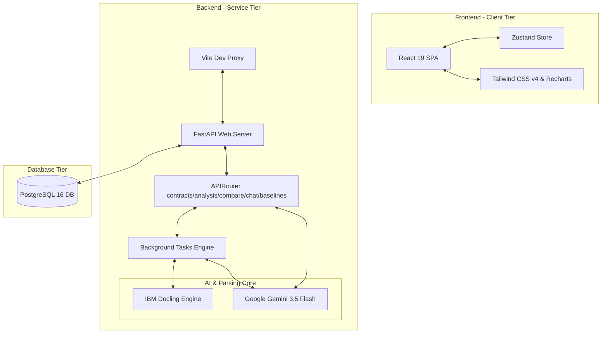
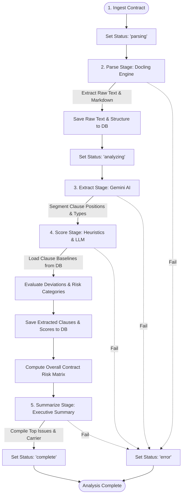
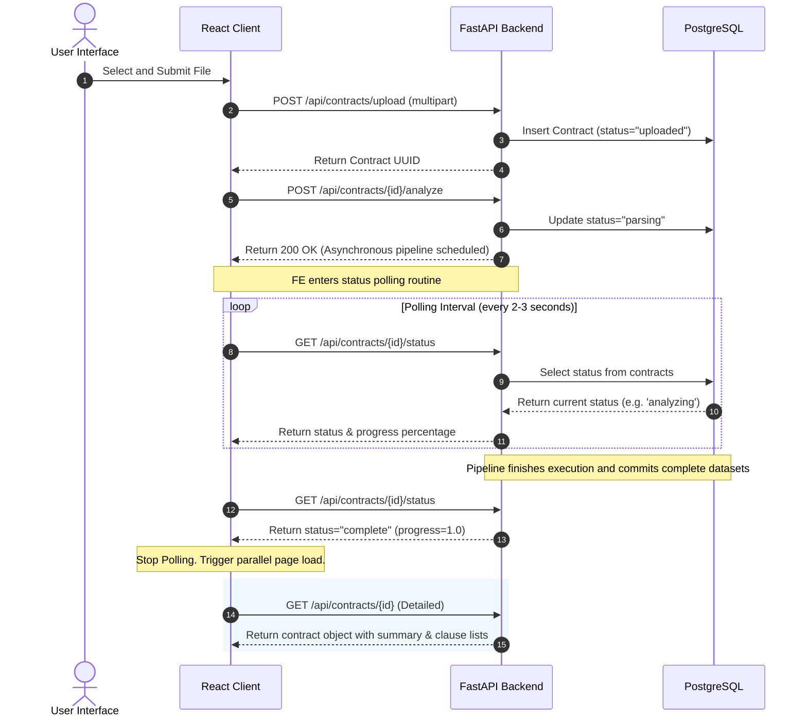
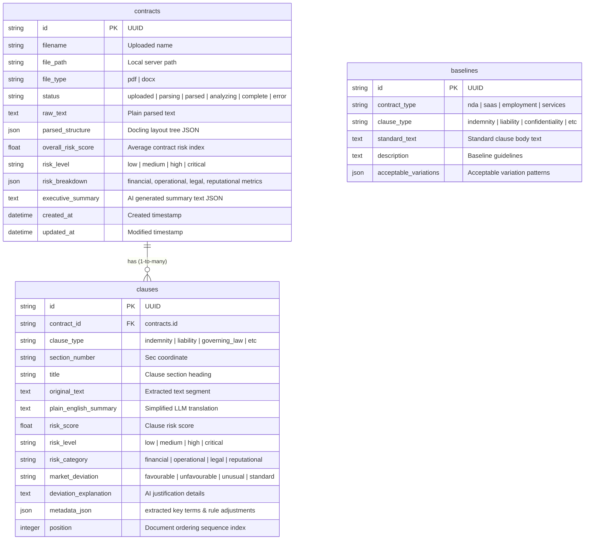

# LAI Architecture & Design Reference

This document outlines the high-level architecture, pipeline mechanics, frontend-backend communications, and database schemas powering the Legal Document Intelligence (LAI) platform.

---

## 🏗️ High-Level System Architecture

LAI is engineered as a decoupled, 3-tier application designed for high-fidelity document ingestion, low-latency asynchronous processing, and detailed data rendering.

---

## 🔄 Asynchronous Analysis Pipeline

When a contract is submitted, its analysis is processed off the main request thread using FastAPI's `BackgroundTasks` to avoid HTTP timeouts. The pipeline executes five distinct stages:

### Deep Dive into Pipeline Stages

#### 1. Parse (IBM Docling)
- **Action**: Converts binary PDFs or DOCX uploads into structured format.
- **Engine**: Local layout models partition paragraphs, list bullet items, extract embedded tables, and build a nested tree structure.
- **Result**: Exports structured raw markdown and text.

#### 2. Extract (Google Gemini 3.5 Flash)
- **Action**: Segments the parsed markdown text into distinct contractual clauses (e.g., `indemnity`, `liability`, `termination`).
- **Mechanism**: Invokes Gemini with structured JSON output enforcing a Pydantic schema constraints.
- **Result**: Grouped, typed clauses, complete with titles and document positional coordinates.

#### 3. Score (Rule Heuristics & LLM)
- **Action**: Evaluates individual clauses against market standards.
- **Mechanism**:
  - Matches clause category to template baseline standard texts in the database.
  - Scores liability limits, unilateral terms, and broad exclusions on a `0-100` severity scale.
  - Categorizes risk vectors: **Financial**, **Operational**, **Legal**, and **Reputational**.
- **Result**: Individual clause risk levels (`low`, `medium`, `high`, `critical`) and market deviations (`favourable`, `unfavourable`, `unusual`, `standard`).

#### 4. Summarize (Google Gemini 3.5 Flash)
- **Action**: Synthesizes the overall legal weight of the contract.
- **Result**: Formulates a plain-English synopsis, flags the primary risk-carrying entity, and lists the top three negotiation issues.

---

## 🔌 Frontend-Backend Communication

Communication between tiers is designed around REST design guidelines and event loop polling.

---

## 🗄️ Database Schema Design

The persistence tier consists of three core tables managed via SQLAlchemy. Relationships cascade on deletions to enforce relational integrity.

### Table References & Data Dictionary

#### 1. `contracts`
Holds overall document files metadata, parsed texts, and synthesized risk profiles.

| Column | Type | Constraints | Description |
| :--- | :--- | :--- | :--- |
| `id` | `VARCHAR(36)` | PRIMARY KEY | Unique ID (UUIDv4) representing the contract. |
| `filename` | `VARCHAR(255)` | NOT NULL | Human file name uploaded (e.g. `lease_agreement.pdf`). |
| `file_path` | `VARCHAR(500)` | NOT NULL | Path location of binary file stored on server disk. |
| `file_type` | `VARCHAR(10)` | NOT NULL | Upload extension format: `pdf` or `docx`. |
| `status` | `VARCHAR(20)` | DEFAULT `'uploaded'` | Ingestion state flow (`uploaded`, `parsing`, `parsed`, `analyzing`, `complete`, `error`). |
| `raw_text` | `TEXT` | NULLABLE | Plain text format output from parsing. |
| `parsed_structure` | `JSON` | NULLABLE | Complete document layout schema returned by Docling. |
| `overall_risk_score`| `FLOAT` | NULLABLE | Unified aggregate risk score metric (`0.0` to `100.0`). |
| `risk_level` | `VARCHAR(20)` | NULLABLE | Categorized rank (`low`, `medium`, `high`, `critical`). |
| `risk_breakdown` | `JSON` | NULLABLE | Breakdown dictionary containing metrics for each risk category. |
| `executive_summary`| `TEXT` | NULLABLE | AI generated synopsis payload string. |
| `created_at` | `TIMESTAMP` | DEFAULT `utcnow` | Ingestion timestamp. |
| `updated_at` | `TIMESTAMP` | DEFAULT `utcnow` | Modification timestamp. |

#### 2. `clauses`
Stores individual sections of interest extracted from a contract.

| Column | Type | Constraints | Description |
| :--- | :--- | :--- | :--- |
| `id` | `VARCHAR(36)` | PRIMARY KEY | Unique ID (UUIDv4) representing the clause. |
| `contract_id` | `VARCHAR(36)` | FOREIGN KEY (contracts.id) | Relation pointing to the parent contract (Cascade delete). |
| `clause_type` | `VARCHAR(50)` | NOT NULL | Category classification (e.g. `indemnity`, `liability`). |
| `section_number` | `VARCHAR(20)` | NULLABLE | Specific coordinate numbering (e.g. `14.2(b)`). |
| `title` | `VARCHAR(255)` | NULLABLE | Title or header string of the clause block. |
| `original_text` | `TEXT` | NOT NULL | Exact verbatim text extracted from the file. |
| `plain_english_summary`| `TEXT` | NULLABLE | Plain English translated synthesis. |
| `risk_score` | `FLOAT` | NULLABLE | Clause specific risk index (`0.0` to `100.0`). |
| `risk_level` | `VARCHAR(20)` | NULLABLE | Risk rank classification (`low`, `medium`, `high`, `critical`). |
| `risk_category` | `VARCHAR(20)` | NULLABLE | Primary impact vector (`financial`, `operational`, `legal`, `reputational`). |
| `market_deviation` | `VARCHAR(20)` | NULLABLE | Deviation ranking (`favourable`, `unfavourable`, `unusual`, `standard`). |
| `deviation_explanation`| `TEXT` | NULLABLE | Plain text justification for the deviation score. |
| `metadata_json` | `JSON` | NULLABLE | Helper object containing cross references, key terms. |
| `position` | `INTEGER` | NULLABLE | Placement sequence inside the source contract. |

#### 3. `baselines`
Serves as the library of ideal contract clauses against which uploaded documents are compared.

| Column | Type | Constraints | Description |
| :--- | :--- | :--- | :--- |
| `id` | `VARCHAR(36)` | PRIMARY KEY | Unique ID (UUIDv4) representing the baseline. |
| `contract_type` | `VARCHAR(50)` | NOT NULL | Specific contract group (`nda`, `saas`, `employment`, `services`). |
| `clause_type` | `VARCHAR(50)` | NOT NULL | Category classification of standard terms. |
| `standard_text` | `TEXT` | NOT NULL | Target ideal standard clause text. |
| `description` | `TEXT` | NULLABLE | Baseline context description and guidelines. |
| `acceptable_variations`| `JSON` | NULLABLE | List of acceptable language patterns. |
